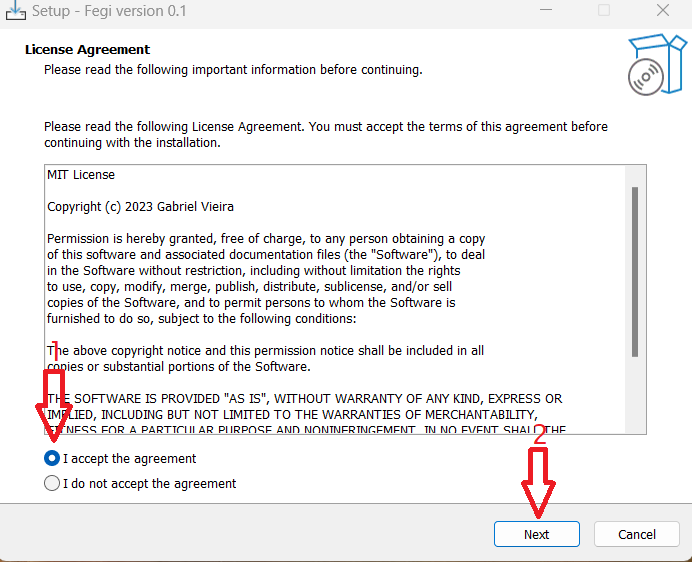
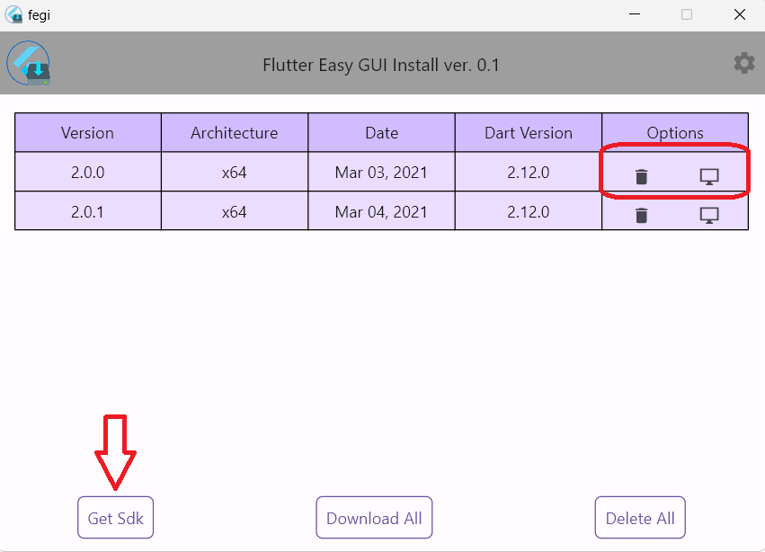

# Fegi

<br />
<div align="center">
  <a href="https://github.com/gabrielgits/fegi">
    
  </a>

  <h2 align="center">Fegi</h2>

  <p align="center">
Flutter Easy GUI Installer is a small yet powerful tool that enables you to set up your Flutter development environment with ease.

FEGI is designed for everyone who wants to efficiently configure their environment without spending time on manual setup each time you need to configure your computer.
    <br />
    <strong>Available platforms</strong>
    <br />
    <div>
    <a href="https://github.com/gabrielgits/fegi/raw/main/setup/fegi-setup-win.exe">&nbsp;<label>Windows&nbsp;&nbsp;</label></a>
    &nbsp;<label>Mac OS X&nbsp;&nbsp;</label>
    &nbsp;<label>Linux</label>
    </div>
  </p>
</div>

## How to install:

Just download the setup file from the link above and run it.

<p align="center">
<a align="center"></a>
<a align="center"></a>
<a align="center"></a>
</p>


## How to Use:

Just download the setup file from the link above and run it.

<p align="center">
<a align="center"></a>
<a align="center"></a>
<a align="center"></a>
</p>

## Features

- ✅ Download and Install one or more flutter SDK.
- ✅ Set flutter SDK on system environment.
- ✴️ Dectect flutter project.
- ✴️ Run flutter project.
- ⛔ Test flutter project.
- ✴️ Multi language.
- ⛔ Multi platforms.
- ✴️ Run as system tray.


# Development

### All the information provided from here is intended for everyone who wishes to contribute to this open project.

This project is a Flutter application.

Before running the project, you will need to install Flutter on your system.

You can effortlessly install Flutter on your system using the provided setup instructions above.

### Add dependency

After cloning the repository, run 'pub get' to install all dependencies

```console
$ flutter pub get
```

## Depedencies

This APP has the following dependencies:

- [flutter](https://flutter.dev/): Main sdk.

### ui:
- [bform](https://pub.dev/packages/bform): Form UI components.

### utils:
- [easy_localization](https://pub.dev/packages/easy_localization): Localization and Internationalization.
- [equatable](https://pub.dev/packages/equatable): Being able to compare objects without override the == operator as well as hashCode.
- [archive](https://pub.dev/packages/archive): Extract zip file and compress folder or file.
- [window_manager](https://pub.dev/packages/window_manager): Resizing and repositioning the window.
- [system_tray](https://pub.dev/packages/system_tray): Support for system tray menu for desktop flutter apps. on Windows, macOS, and Linux.
- [expt](https://github.com/gabrielgits/expt.git): Package to help you exception handling in dart.

### so servive
- [win32_registry](https://pub.dev/packages/win32_registry): Provides a friendly Dart API for accessing the Microsoft Windows registry.

### state management:
- [provider](https://pub.dev/packages/provider): A wrapper around InheritedWidget to make them easier to use and more reusable.

### networking and storage:
- [dio](https://pub.dev/packages/dio): A powerful HTTP client which FormData, request cancellation, file uploading/downloading, etc.
- [shared_preferences](https://pub.dev/packages/shared_preferences): Storing data quickly.
- [path_provider](https://pub.dev/packages/path_provider): Finding commonly used locations on the filesystem.
- [upgrader](https://pub.dev/packages/upgrader): Package for prompting users to upgrade when there is a newer version of the app in the store.


## Technical aspects

- ✨ [Clean code](https://blog.cleancoder.com/)
- 💫 [Clean Dart](https://github.com/Flutterando/Clean-Dart)
- 🌟 [Flutter Clean Architecture](https://resocoder.com/2019/08/27/flutter-tdd-clean-architecture-course-1-explanation-project-structure/)
- ⭐ [SOLID](https://en.wikipedia.org/wiki/SOLID)

